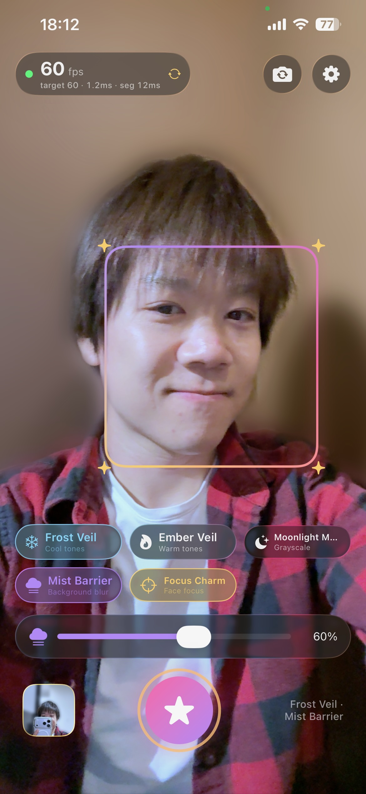
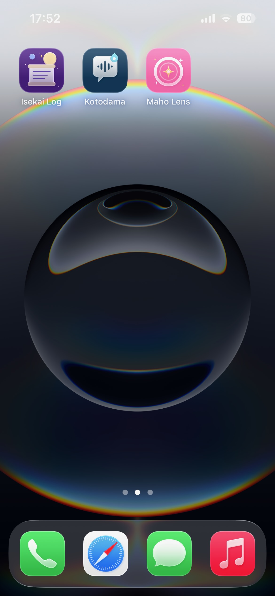
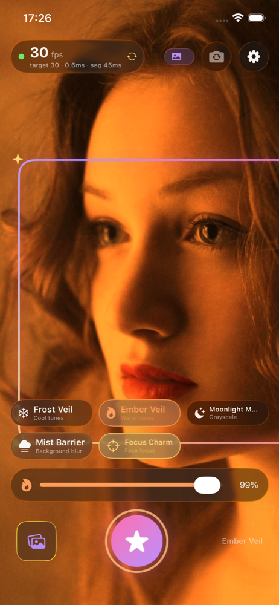
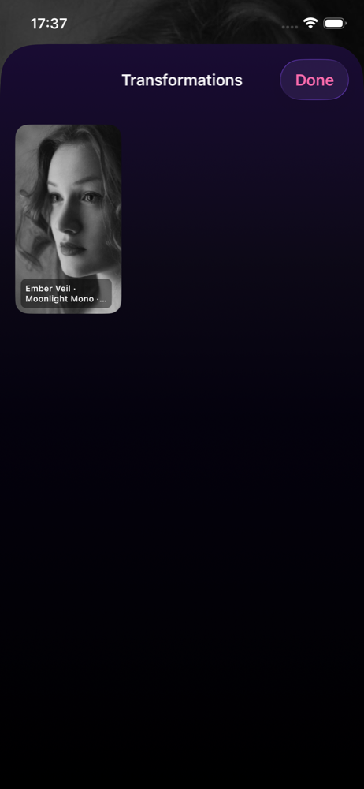

# Maho Lens（魔法レンズ）

> A *mahō shōjo* beauty camera for iOS. Every filter is a transformation spell.

Maho Lens plays on the magical-girl trope of instant transformation: pick a spell and the live
camera preview changes on the spot. Face detection keeps the heroine in focus, person
segmentation blurs the world behind her, and the shutter casts the final "henshin" with a flash
and a burst of sparkles.

Built for the Metanomaly iOS programming assignment (Beauty Camera).


## Showcase

**Screen recording (iPhone 16e):** [docs/showcase/maho-lens-showcase.mp4](docs/showcase/maho-lens-showcase.mp4)

| On device: 60 fps with Mist Barrier and Focus Charm | Home screen | Simulator: Ember Veil | Gallery |
| --- | --- | --- | --- |
|  |  |  |  |

Submission documents: [AI conversation log](docs/AI_CONVERSATION_LOG.md) · [Models, parameters and metrics](docs/MODELS.md) · [Bug list](docs/BUGS.md) · [Optimizations](docs/OPTIMIZATIONS.md)

## Spells and requirements

| Requirement | Spell | How |
| --- | --- | --- |
| Single-person face detection and focus | **Focus Charm** | `VNDetectFaceRectanglesRequest`; the largest face wins, drives the camera's focus and exposure point of interest, and gets a glowing reticle |
| Cool and warm color toning | **Frost Veil** / **Ember Veil** | `CITemperatureAndTint` white-balance shift, adjustable strength |
| Grayscale for the entire preview | **Moonlight Mono** | `CIColorControls` saturation 0 |
| Background blur outside the subject, adjustable strength | **Mist Barrier** | `VNGeneratePersonSegmentationRequest` mask blended over a quarter-resolution Gaussian blur, strength slider |
| Take photos and save them to local storage | Shutter | `AVCapturePhotoOutput`; the still gets an *accurate* segmentation pass and the same spells, then is saved to the app's Documents (always) and the Photos library (if allowed) |
| 30 fps setting ≥ 25 fps, 60 fps setting ≥ 50 fps | FPS dial | Capture format chosen per rate, Metal-backed Core Image rendering in an `MTKView`, live preview-rate dial that turns green when the target is met |

## Performance design

- **Capture**: `AVCaptureVideoDataOutput` delivers BGRA frames already rotated upright and mirrored
  for the front camera. `FormatSelector` picks the tallest format up to 1080p that supports the
  requested rate and locks min and max frame duration to it.
- **Analysis off the hot path**: Vision runs on its own serial queue and drops frames while busy, so
  segmentation never stalls capture or rendering. The newest mask is reused until the next one lands.
- **Blur at quarter resolution**: the Gaussian blur runs on a 0.25× copy and is scaled back up,
  cutting GPU cost roughly 16× for a softer, lens-like fall-off.
- **Render once per new frame**: the `MTKView` ticks at the target rate but only renders when a new
  frame arrived, so the measured preview rate is the real one. Core Image renders straight into the
  drawable texture with a Metal command buffer.
- **Metrics**: preview, capture and analysis rates over a one-second window, render and analysis
  milliseconds, low and peak preview rate, all shown on the dial and copyable from Settings as a
  performance report for the submission.

Real frame rates can only be measured on a device. The Simulator has no camera, so the app falls
back to a **demo portrait source** that animates a bundled photo through the same pipeline; the UI
test uses it for screenshots.

## Architecture

```
Maho Lens/
  Domain/        SpellState + Spell, CaptureSettings (frame rate, FormatSelector, CameraGeometry), PerformanceMetrics
  Camera/        FrameSource protocol, CameraFrameSource (AVCaptureSession), DemoFrameSource (Simulator)
  Vision/        SubjectAnalyzer: face rectangles + person segmentation with frame dropping
  Rendering/     SpellRenderer (Core Image graph, Metal CIContext), MetalPreviewView (MTKView + PreviewRenderer)
  Features/      Camera (view + view model), Gallery, Settings
  Support/       Theme (magical-girl palette, sparkles), AppSettings, PhotoStore
```

## Getting started

```sh
open "Maho Lens.xcodeproj"
```

Run on a physical iPhone for the camera. In the Simulator the demo portrait runs automatically;
pass `-demo-source` to force it on a device. Camera and Photos permissions are requested on first
use.

## Tests

```sh
xcodebuild test -project "Maho Lens.xcodeproj" -scheme "Maho Lens" \
  -destination 'platform=iOS Simulator,name=iPhone 16e'
```

- `Maho LensTests` (Swift Testing): spell toggles and intensities, tone direction (warm raises red,
  cool raises blue), grayscale, masked blur keeping the subject sharp, aspect-fill math, device
  point-of-interest mapping, format selection, frame-rate counters and thresholds, photo storage,
  and Vision face plus person detection on the demo portrait.
- `Maho LensUITests` (XCTest): runs the demo source, casts each spell, toggles 30/60 fps, takes a
  photo, opens the gallery and settings, and saves screenshots to `/tmp/maho-screens`.

## Known issues and tuning notes

- **Fixed:** the `MTKView` hosting the preview intercepted every touch in the top bar even though the
  SwiftUI controls were layered above it; the gallery and shutter at the bottom were unaffected.
  Disabling user interaction on the preview view fixed it. A regression UI test taps the top bar.
- **Fixed:** `CITemperatureAndTint` warms the image when the *target* neutral is below the source
  neutral, the opposite of the first implementation. A unit test now pins the direction.
- The Simulator has no neural-engine runtime ("E5RT is not supported"), so person segmentation
  and face-detection revision 3 fail there. The app uses face-detection revision 2 in the Simulator
  and, whenever segmentation is unavailable, synthesizes a soft head-and-shoulders oval from the
  face so Mist Barrier still works. Device builds use the real segmentation mask.
- Simulator frame rates are not meaningful: Core Image runs without a GPU there and the demo
  source itself costs CPU. The 25/50 fps thresholds must be measured on a device.
- Device point-of-interest mapping for focus is derived for portrait frames rotated 90° and
  mirrored; it is unit-tested on the corners but needs confirmation on hardware.
- Front cameras on many iPhones have fixed focus; the Focus Charm then drives exposure only and the
  reticle.
- Segmentation quality defaults to *Balanced*; switch to *Fast* if 60 fps is not met with Mist
  Barrier on older devices. Stills always use *Accurate*.
- The demo portrait is Lorem Picsum image 1027 (Unsplash licence), used only for the Simulator.

## License

Copyright © 2026 Kyle Zhao. All rights reserved.
